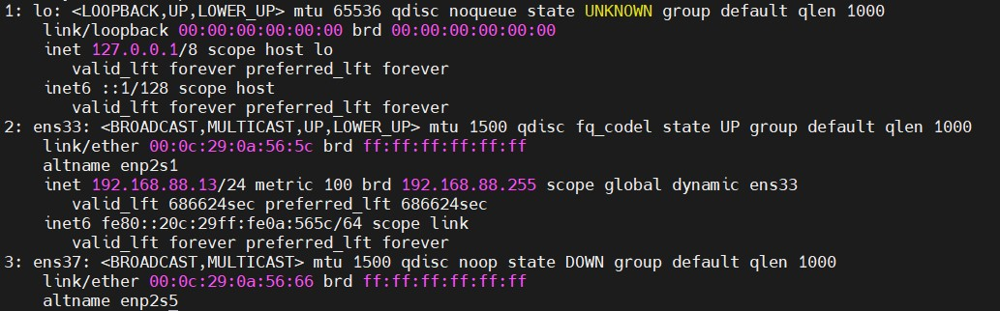
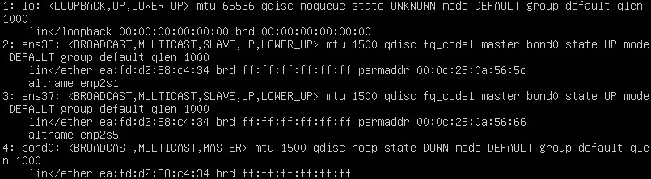
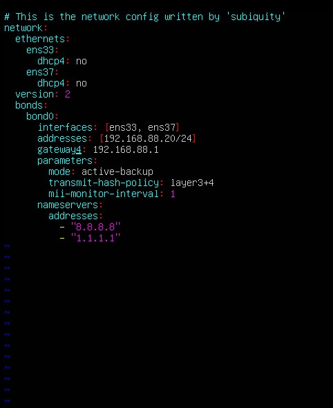
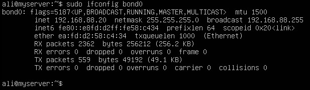
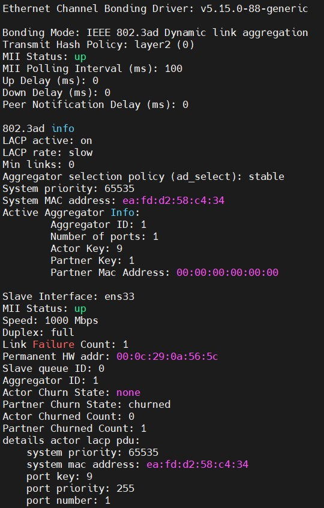
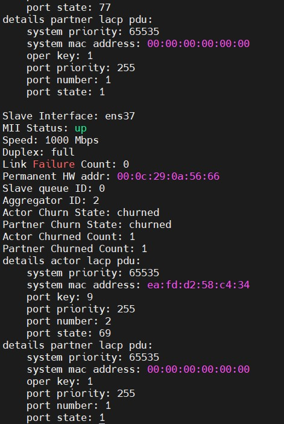
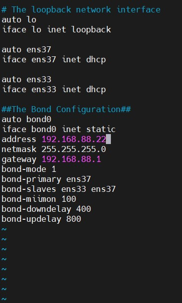

# Install and configure bonding on Ubuntu 22.04

### Before we begin, you need to ensure that the bonding module is installed on your Kernel using the command below.

## Load the module.

```bash

sudo modprobe bonding

```

### verify it is enabled

```bash 

sudo lsmod | grep bondig

# bonding               200704  0
# tls                   114688  1 bonding

```
## Otherwise, you will be required to install it:

```bash

sudo apt install ifenslave

```
# Configure bonding

```bash

ip a

```




### Here, we have two interfaces ens33 and ens37. Ensure the two interfaces are disconnected.


```bash

sudo ifconfig ens33 down
sudo ifconfig en down

```

## Create a network bond with the type 802.3ad

```bash

sudo ip link add bond0 type bond mode 802.3ad

```

## Once created, add the two network interfaces to it.


```bash

sudo ip link set ens33 master bond0
sudo ip link set ens37 master bond0

```

## Verify the bond creation 


```bash

sudo ip link

```




### That is it, we have created a temporary bond. Remember this will be lost once the system reboots.


## To configure a permanent Network Bonding on Ubuntu, edit the Netplan YAML file


```bash

sudo vim /etc/netplan/00-installer-config.yaml

```




### save and exit


## Stop two interfaces

```bash

sudo ifconfig ens33 down
sudo ifconfig ens37 down

```

## Restart network

```bash

sudo netplan apply

```

## Now Start the network bonkd

```bash

sudo ifconfig bond0 up

```

## Verify if the bond is running

```bash

sudo ifconfig bond0


```


 


## You can also view the detailed Network bond status

```bash

sudo cat /proc/net/bonding/bond0

```








# Configure Permanent Bonding 

## In the file, configure Network Bonding by adding the bond interface

```bash 

sudo vim /etc/network/interfaces

```




## activate the bond 


```bash

sudo ifup bond0


```

# The bond should be available

