# Raid 1 rocky linux
### after adding disk 
```bash

lsblk

```
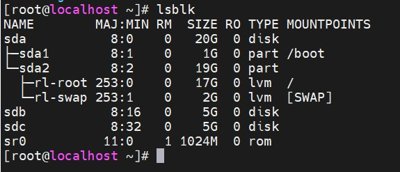

### see the 2 disk added sdb and sdc.

## Now create partion with fdisk

```bash

fdisk /dev/sdb

```

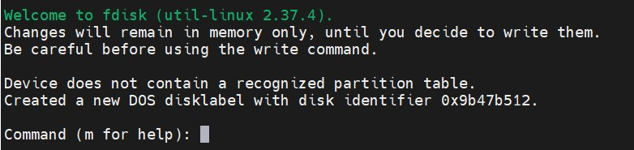

### type 'm' for help
m

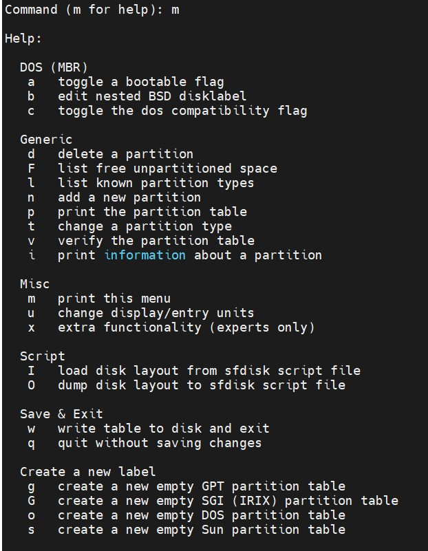

### As you can see in screenshot for create new partition type n

n 

 

### Now type 'p' for select primary or press enter

p

### press enter key for defaul partition number

### can type the first sector or press enter for default 

### also for end sector

### type 'm' for show help menu 


### As you can see in screenshot for change partition type , type 't'

### if you know hex code for partition type , enter that or you don't know enter " Shift + L " for list 

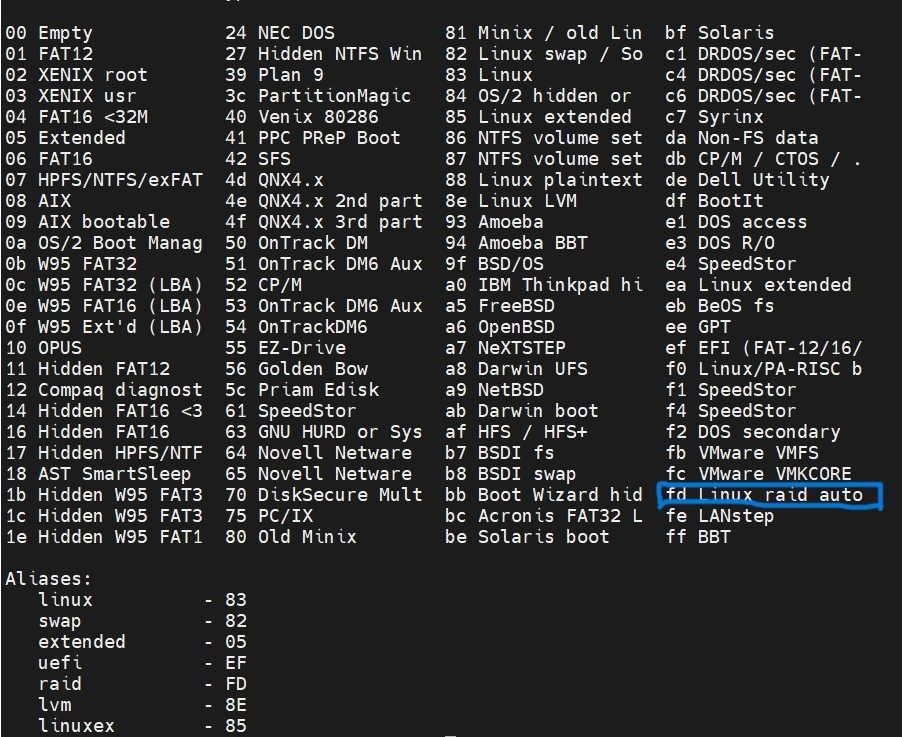

### As you can see on screenshot , partition type for raid is marked , that's hex code is "fd" 

fd

#### changed type of partition 'Linux' to 'Linux raid autodetect' 

### press 'w' for write and exit from fdisk enviroment 

## Now create partition for sdc disk

## Create partion with fdisk

```bash

fdisk /dev/sdc

```


### type 'm' for help
m


### As you can see in screenshot for create new partition type n

n 

 

### Now type 'p' for select primary or press enter

p

### press enter key for defaul partition number

### can type the first sector or press enter for default 

### also for end sector

### type 'm' for show help menu 


### As you can see in screenshot for change partition type , type 't'

### if you know hex code for partition type , enter that or you don't know enter " Shift + L " for list 


### As you can see on screenshot , partition type for raid is marked , that's hex code is "fd" 

fd

#### changed type of partition 'Linux' to 'Linux raid autodetect' 

### press 'w' for write and  exit from fdisk enviroment 

## install mdadm 

```bash

yum install -y mdadm

``` 
## create array 

```bash

mdadm --create --verbos /dev/md0 level=1 --raid-devices=2 /dev/sdb1 /dev/sdc1 

lsblk

```
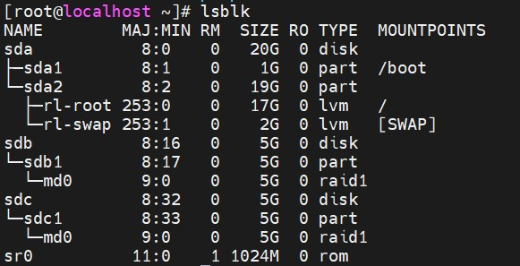

# Add disk to array ( add disk to raid)

### after adding disks to system 

```bash

lsblk

```
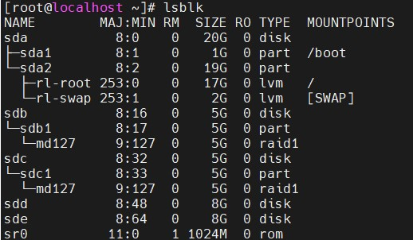

### see the 2 disk added sdd and sde.

## Now create partion with fdisk

```bash

fdisk /dev/sdd

```


### type 'm' for help
m


### As you can see in screenshot for create new partition type n

n 

 

### Now type 'p' for select primary or press enter

p

### press enter key for defaul partition number

### can type the first sector or press enter for default 

### also for end sector

### type 'm' for show help menu 


### As you can see in screenshot for change partition type , type 't'

### if you know hex code for partition type , enter that or you don't know enter " Shift + L " for list 


### As you can see on screenshot , partition type for raid is marked , that's hex code is "fd" 

fd

#### changed type of partition 'Linux' to 'Linux raid autodetect' 

### press 'w' for write and exit from fdisk enviroment 

## Now create partition for sde disk

## Create partion with fdisk

```bash

fdisk /dev/sde

```


### type 'm' for help
m


### As you can see in screenshot for create new partition type n

n 

 

### Now type 'p' for select primary or press enter

p

### press enter key for defaul partition number

### can type the first sector or press enter for default 

### also for end sector

### type 'm' for show help menu 


### As you can see in screenshot for change partition type , type 't'

### if you know hex code for partition type , enter that or you don't know enter " Shift + L " for list 


### As you can see on screenshot , partition type for raid is marked , that's hex code is "fd" 

fd

#### changed type of partition 'Linux' to 'Linux raid autodetect' 

### press 'w' for write and  exit from fdisk enviroment

## show new partitions 

```bash 

lsblk

```
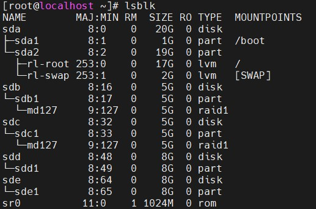 

## Create a raid 0 with new disks added (sdd1 and sde1) then add exist raid1 disks to the new raid 0 disks 

```bash 

mdadm --create --verbos /dev/md10 level=0 --raid-devices=2 /dev/sdd1 /dev/sde1

```

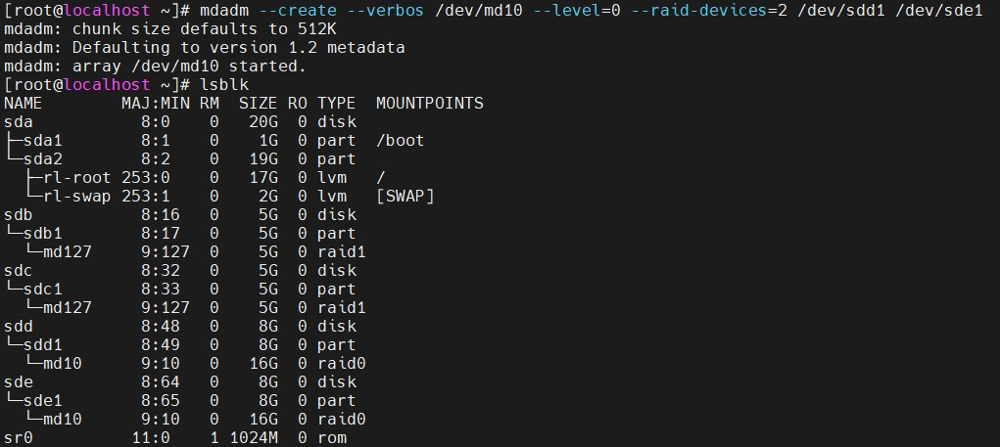

```bash

mdadm --add /dev/md127 /dev/md10

```

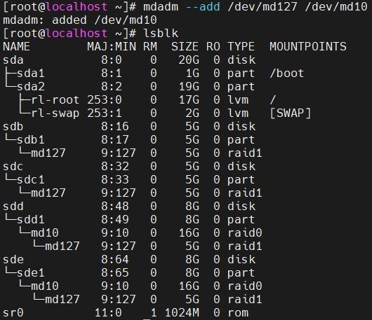

## Remove md127 

```bash

mdadm --remove /dev/md127 /dev/md10

```
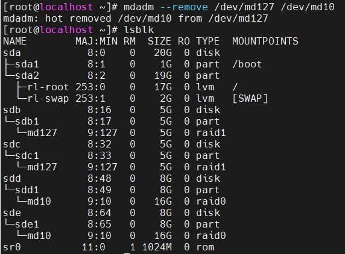 

## Remove super block

```bash 

mdadm --stop /dev/md10
mdadm --zero-superblock /dev/sde1 /dev/sdd1 

```
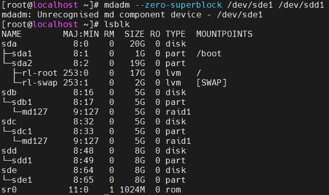


